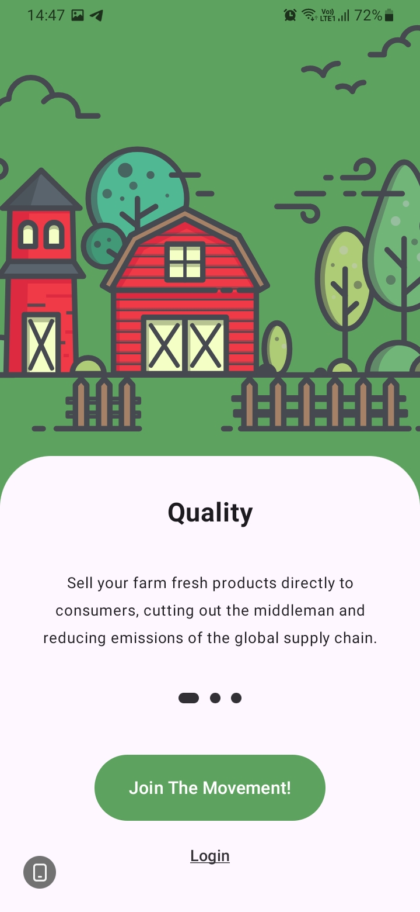
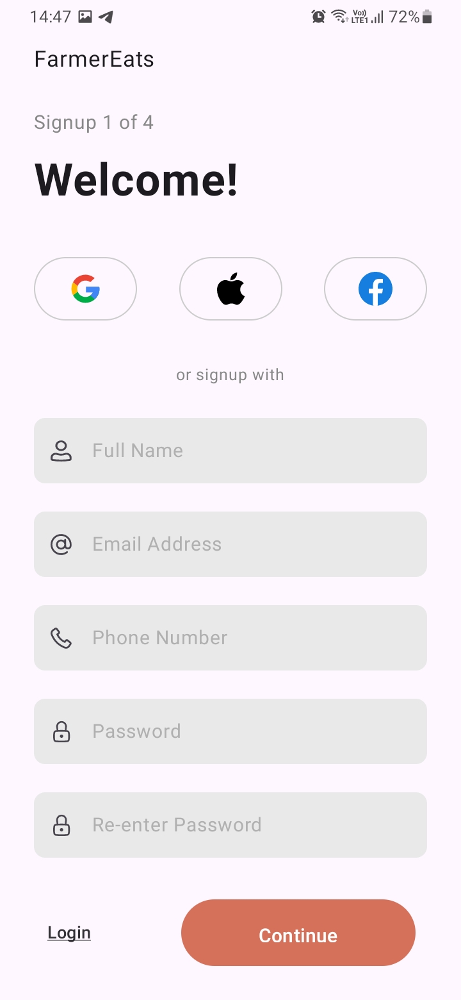
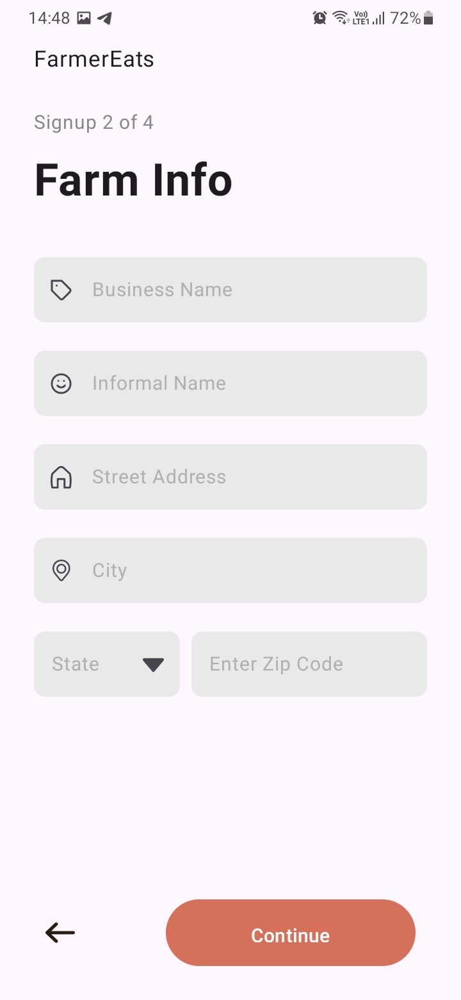
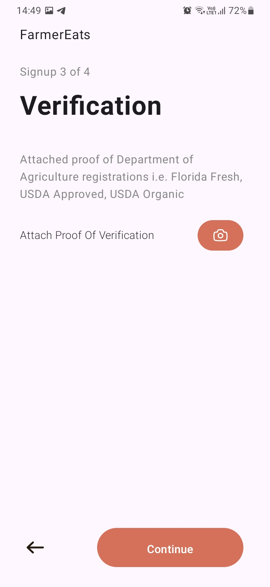
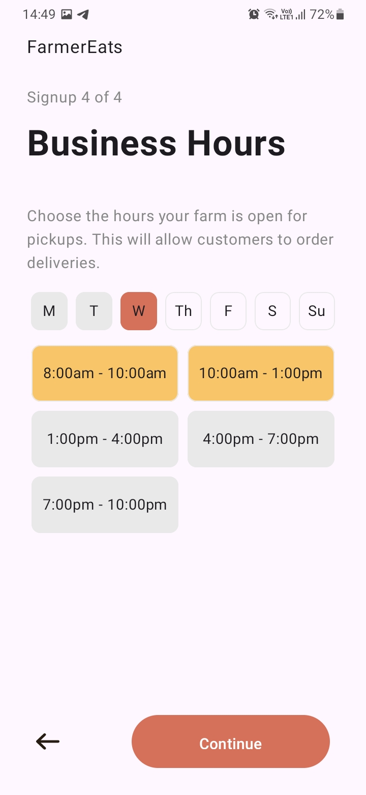
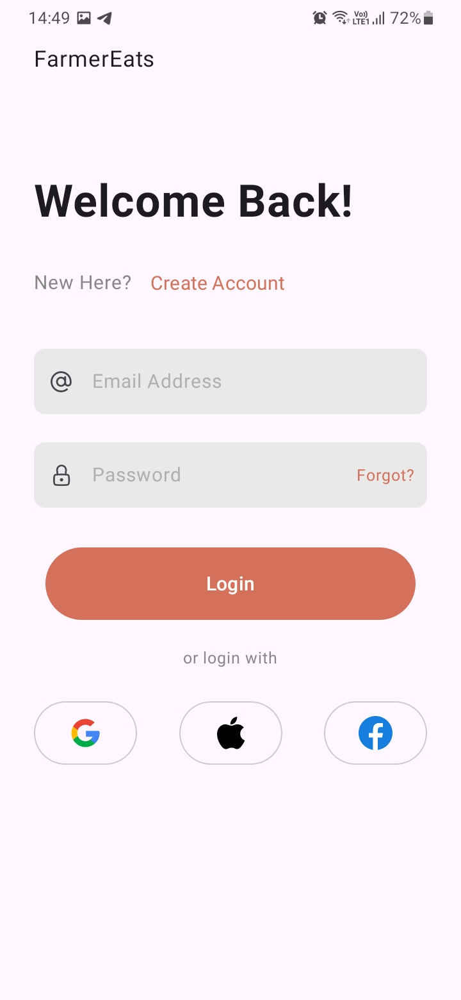
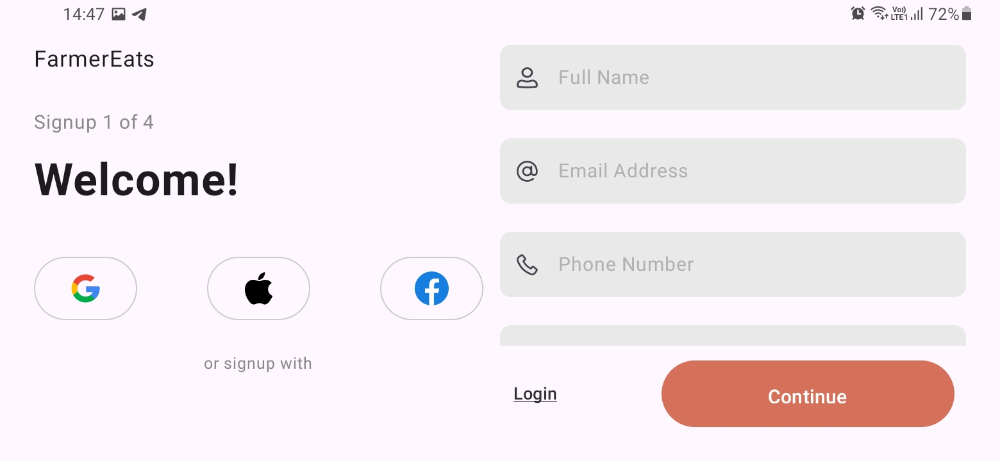
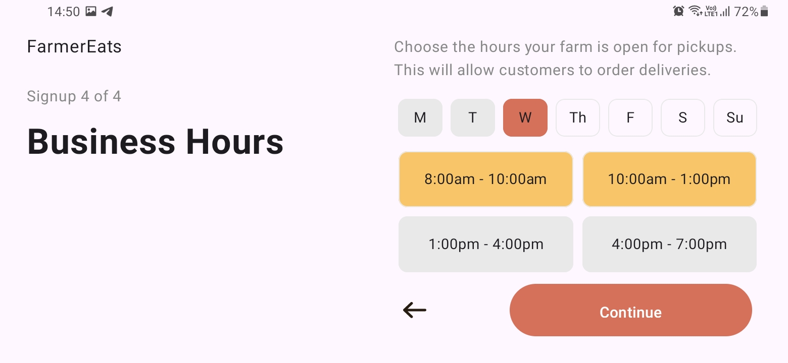

# 📱 Login and Sign-Up App

A robust and secure login and sign-up app that integrates REST API using Retrofit. Users can register by filling in their email details or by signing up directly via Google, Apple, or Facebook. The app also allows users to input business details, upload verification documents, and select operational dates for their shops.

> **Note**: This is an internship assignment project. The portrait UI was initially provided by **Software Lab**, and I have enhanced it with additional modifications, including full landscape mode support, along with implementing the complete code.
## 📝 Project Overview

The **Login and Sign-Up App** provides a seamless user authentication system with persistent login functionality. Users can either sign in using their credentials or sign up through various methods such as Google, Apple, and Facebook. Once signed up, users can input business information, upload a business verification document, and select the dates when their shop is operational. All this data is securely sent and stored on a server using a REST API via Retrofit.

## App Screenshots

Below are some screenshots showcasing the key features of the app:

<div align="center"> 
  <table> 
    <tr> 
      <td align="center"> 
         <br /> <strong>Welcome Screen</strong> 
      </td> 
      <td align="center"> 
         <br /> <strong>Sign-Up page</strong> 
      </td> 
      <td align="center"> 
         <br /> <strong>Business Details</strong> 
      </td> 
    </tr>
    <tr>
      <td align="center"> 
         <br /> <strong>Verification Document</strong> 
      </td> 
      <td align="center"> 
         <br /> <strong>Operational Dates</strong> 
      </td> 
      <td align="center"> 
         <br /> <strong>Login Screen</strong> 
      </td> 
    </tr>
  </table> 
</div>

## 📱 Landscape Mode Screenshots

The app is fully optimized for **landscape mode**, providing a seamless user experience on all orientations. Below are screenshots of the app in landscape mode:

<div align="center"> 
  <table> 
    <tr> 
      <td align="center"> 
         <br /> <strong>Sign-Up in Landscape</strong> 
      </td> 
      <td align="center"> 
         <br /> <strong>Business Details in Landscape</strong> 
      </td> 
    </tr>
  </table> 
</div>

## 📋 Requirements

To use this app effectively, make sure the following conditions are met:

- **Internet Connection**: The app requires an active internet connection to communicate with the server and use the REST API.

## ⚙️ Setup and Installation

### How to Build and Run the Project

1. **Clone the Repository**  
   Open your terminal and run:
   ```bash
   git clone https://github.com/your-username/login-signup-app.git
   cd login-signup-app
   ```


3. **Open the Project in Android Studio**  
    Launch Android Studio and open the project by navigating to the cloned repository folder.
    
4. **Install Dependencies**  
    Ensure all required SDKs, libraries, and dependencies (like Retrofit) are installed. Android Studio will notify you if anything is missing.
    
5. **Build the Project**
    
    - Go to the `Build` menu and select `Rebuild Project`.
    - Make sure there are no errors during the build process.
6. **Run the App**
    
    - Connect your Android device or open an emulator.
    - Click the `Run` button or use the `Shift + F10` shortcut to launch the app on your selected device.

### Output APK

The output APK can be found at `outputs/apk/debug/app-debug.apk`. You can install this APK on your Android device to use the app.

## 🚀 Usage Instructions

1. **Welcome Screen**  
    Upon launching the app, users are greeted with the **Welcome Screen** where they can either:
    
    - **Sign Up**: Register with email, Google, Facebook, or Apple.
    - **Log In**: If already registered, log in using the previously entered credentials.
2. **Sign-Up Process**
    
    - **Email Sign-Up**: Fill in your email, set a password, and continue with the sign-up process.
    - **Google/Facebook/Apple Sign-Up**: Directly sign up using any of these platforms (Facebook may not be functional due to pending business verification).
    - **Business Details**: After account creation, fill in business details, upload a business verification document, and select operational dates.
3. **Login Process**
    
    - **Log In**: Enter the credentials created during sign-up.
    - **Persistent Login**: Once logged in, the session remains active unless manually logged out.

## Known Issues

- **Facebook Login**: The Facebook sign-up button doesn't work due to pending business verification.
- **Apple Sign-In**: Currently not implemented in the app.
- **OTP Sending**: Server may not send the OTP occasionally. If the error persists, please retry after some time.

## 🛠️ Troubleshooting

- **App Crashes on Startup**: Ensure that you have all necessary dependencies and that the device or emulator is properly configured.
- **Login Issues**: Ensure that the correct credentials are entered, and check your internet connection.
- **Business Document Upload Fails**: Try restarting the app or ensuring that you have a stable internet connection when uploading files.

## 🔮 Future Releases

- Integration of Apple sign-in for a smoother user experience.
- Improved performance optimization and bug fixes.
- Business verification via Facebook sign-in.
- UI improvements for a more modern look and feel.

## 💡 Advantages

- **Persistent Login**: Once logged in, users don't need to re-enter their credentials.
- **Multiple Sign-Up Options**: Sign-up using email, Google, Apple, or Facebook.
- **Optimized for Landscape Mode**: The app offers a seamless experience in both portrait and landscape orientations.
- **REST API Integration**: Business data is securely sent to and stored on the server via REST API using Retrofit.

## 🤝 How to Contribute

We encourage contributions from the community! Here's how you can contribute to this project:

1. **Fork the Repository**  
    Click the `Fork` button at the top right of the repository page to create your own copy of the repository.
    
2. **Create a New Branch**  
    Create a new branch for your feature or bug fix:
   ```bash
   git checkout -b feature-name
   ```

    
3. **Make Your Changes**  
    Implement your changes and ensure that they align with the project's coding standards.
    
4. **Commit Your Changes**  
    Commit your changes with a descriptive message:
   ```bash
 	git commit -m "Implemented feature X or fixed bug Y"
   ```

6. **Push Your Changes**  
    Push your branch to your repository:
   ```bash
 	git push origin feature-name
   ```

6. **Submit a Pull Request**  
    Go to the original repository on GitHub and submit a pull request. Provide details about the changes you made.
    

## 📞 Contact Information

For any questions or support, please contact:

- **Name:** Sai Pavan Kiran
- **GitHub:** [SaiPavanKiran](https://github.com/SaiPavanKiran)

